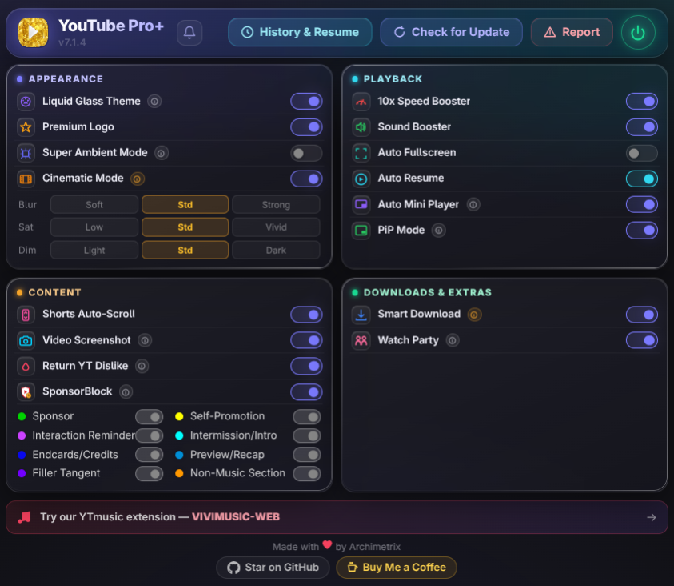

  
  <h1>YouTube Pro Plus</h1>

  
  

**YouTube Pro +** is an all-in-one, highly optimized extension designed to completely overhaul your YouTube experience. It makes your browsing so much smoother with a bundle of useful features and a stylish theme, all packed into one centralized, lightweight extension with a beautiful **Liquid Glass** UI.

  

---

## 📥 Download

  
  
  

> **Note:** Currently available officially on the Firefox and Microsoft Edge Add-ons stores. Chrome, Opera, and other Chromium users should use the **Download ZIP** button above and follow the quick **Local Installation** guide below.

---

## 🎥 Watch It in Action
Click the image below to watch the full showcase and installation guide:

---

## ✨ Key Features

* **🎨 Liquid Glass Theme:** A gorgeous, system-wide glassmorphism redesign of YouTube, featuring beautifully rounded corners, blurred dynamic backgrounds, and custom "Capsule" hover effects for Shorts.
* **👑 Premium Logo Toggle:** Instantly replaces the standard YouTube logo with the clean YouTube Premium logo.
* **🌌 Super Ambient Mode:** Enhances YouTube's native ambient mode with a wider, more vibrant glow around the video player.
* **🌠 Cinematic Mode:** A custom cinematic mode that works with both light mode and dark mode.
* **⚡ 10x Speed Booster:** Bypasses YouTube's native 2x speed limit, letting you seamlessly increase playback speed up to 10x directly from the native player settings.
* **🎛️ Sound Booster:** Boosts a YouTube video's volume as much as you need.
* **🔁 Shorts Auto-Scroller:** A robust background script that intelligently detects when a YouTube Short finishes and automatically scrolls to the next one — completely hands-free.
* **⬇️ Smart Download:** Smart third-party download support that replaces the default download button (if you'd rather use the normal download, just turn the setting off in the extension).
* **⏯️ History & Auto-Resume:** A smart system that stores every video you've watched, along with the date and duration watched. Next time you click a video, it resumes right where you left off, with full control over the relevant settings — plus a built-in recap showing your all-time top 5 videos and top 5 channels.
* **📸 Screenshot Video Frames:** Screenshot any video with `Alt+Shift+S`, or click the camera icon in the player.
* **🎉 Watch Party:** Watch videos together with friends and family, with in-YouTube chat included.
* **🎉 Auto Miniplayer:** A miniplayer automatically shows up when you scroll down .

---

## 🛠️ Local Installation (Chrome, Opera, Brave, Vivaldi, etc.)

For users on Chromium browsers where the extension isn't yet in the store, you can install the latest stable build locally in Developer Mode in just a few steps:

1. **Download the Extension:** Click the **Download ZIP** button in the Download section above and extract the folder to your computer.
2. **Open Extensions:** Open your browser and type `chrome://extensions/` (or `opera://extensions/` / `brave://extensions/`) in the URL bar.
3. **Enable Developer Mode:** Toggle the **"Developer mode"** switch in the top-right corner of the page.
4. **Load the Extension:** Click **"Load unpacked"** in the top-left and select the extracted `Youtube-Pro-Plus-main` folder.
5. *Important:* Disable any conflicting Tampermonkey scripts or Stylus themes.
6. **Refresh YouTube** and enjoy!

---

## 🖥️ Usage

* **Main Settings:** Click the `YouTube Pro +` extension icon in your toolbar to open the Liquid Glass settings popup. From here, you can toggle every feature on or off in real time.

---

## ⚠️ Disclaimer

This extension modifies YouTube's native DOM and playback variables. If YouTube updates its interface, some features (like the Shorts Scroller or Speed Booster) may temporarily stop working until the selectors are updated in the code.

The download feature relies entirely on third-party websites, so it may stop working at any time. If you run into any issues, please raise them on GitHub.

---

## ⚖️ License & Copyright

**Copyright © 2026 Archimetrix. All Rights Reserved.**

> This repository and its contents are proprietary. You may not copy, reproduce, distribute, publish, display, perform, modify, create derivative works from, transmit, or otherwise exploit any of this content, nor may you distribute any part of it over any network — including a local area network — sell or offer it for sale, or use it to construct any kind of database.
